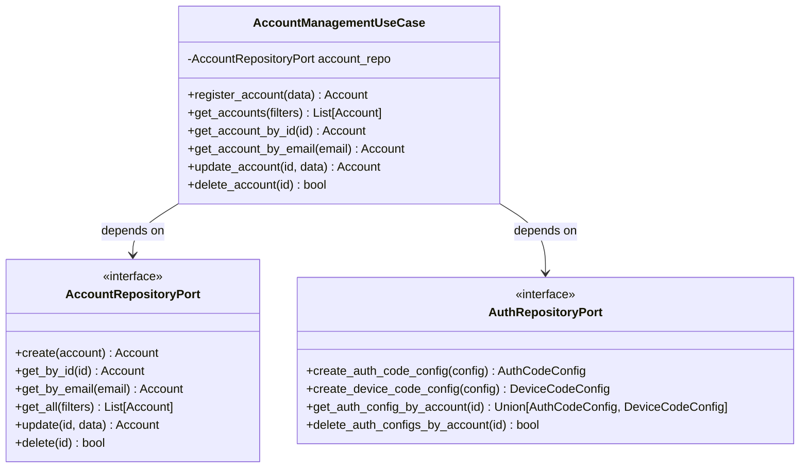

# 시스템 패턴 및 아키텍처

## 프로젝트 아키텍처

### 클린 아키텍처 구조
```
GraphAPIQuery_rev4/
├── core/                    # 비즈니스 로직 (외부 의존성 없음)
│   ├── domain/             # 도메인 엔티티 및 포트
│   │   ├── entities.py     # Account, AuthCodeConfig, DeviceCodeConfig
│   │   └── ports.py        # Repository, Service 인터페이스
│   └── usecases/           # 비즈니스 유즈케이스
│       ├── account_management.py
│       ├── authentication.py
│       └── mail_processing.py
├── adapters/               # 외부 연결 어댑터
│   ├── api/               # FastAPI 라우터 (미구현)
│   ├── cli/               # CLI 인터페이스
│   │   ├── account_commands.py
│   │   └── db_commands.py
│   └── db/                # 데이터베이스 어댑터
│       ├── database.py
│       ├── models.py
│       └── repositories.py
├── config/                # 설정 관리
│   └── adapters.py        # 설정 기반 어댑터 팩토리
└── main.py               # CLI 진입점
```

### 포트/어댑터 패턴 적용

#### 포트 (Interfaces)
- **AccountRepositoryPort**: 계정 데이터 접근 인터페이스
- **AuthRepositoryPort**: 인증 데이터 접근 인터페이스
- **ConfigPort**: 설정 접근 인터페이스
- **GraphServicePort**: Graph API 서비스 인터페이스 (예정)

#### 어댑터 (Implementations)
- **SQLAlchemyAccountRepository**: SQLAlchemy 기반 계정 저장소
- **SQLAlchemyAuthRepository**: SQLAlchemy 기반 인증 저장소
- **ConfigAdapter**: Pydantic Settings 기반 설정
- **CLIAdapter**: Typer 기반 CLI 인터페이스
- **APIAdapter**: FastAPI 기반 REST API (예정)

## 클래스 다이어그램

### 도메인 엔티티
```mermaid
classDiagram
    class Account {
        +UUID account_id
        +str email
        +str display_name
        +AuthType auth_type
        +str tenant_id
        +datetime created_at
        +datetime updated_at
    }
    
    class AuthCodeConfig {
        +UUID config_id
        +UUID account_id
        +str client_id
        +str client_secret
        +str redirect_uri
        +List[str] scopes
        +datetime created_at
        +datetime updated_at
    }
    
    class DeviceCodeConfig {
        +UUID config_id
        +UUID account_id
        +str client_id
        +List[str] scopes
        +datetime created_at
        +datetime updated_at
    }
    
    class AuthType {
        <<enumeration>>
        AUTH_CODE
        DEVICE_CODE
    }
    
    Account ||--o{ AuthCodeConfig : has
    Account ||--o{ DeviceCodeConfig : has
    Account --> AuthType : uses
```

### 유즈케이스 및 포트


## 어댑터 리스트

### 현재 구현된 어댑터

#### 1. CLI 어댑터
- **파일**: `adapters/cli/account_commands.py`
- **역할**: CLI 명령어를 유즈케이스 호출로 변환
- **기능**: 
  - 입력 파싱 및 검증
  - 유즈케이스 호출
  - 결과 포맷팅 (Rich 테이블)
  - 에러 처리

#### 2. 데이터베이스 어댑터
- **파일**: `adapters/db/repositories.py`
- **역할**: 도메인 엔티티와 SQLAlchemy 모델 간 변환
- **기능**:
  - CRUD 연산
  - 도메인 엔티티 ↔ ORM 모델 변환
  - 트랜잭션 관리

#### 3. 설정 어댑터
- **파일**: `config/adapters.py`
- **역할**: 환경 기반 설정 관리 및 어댑터 팩토리
- **기능**:
  - 환경변수 기반 설정 로드
  - 어댑터 인스턴스 생성
  - 의존성 주입

### 예정된 어댑터

#### 4. Graph API 어댑터 (2단계)
- **예상 파일**: `adapters/graph/client.py`
- **역할**: Microsoft Graph API 호출
- **기능**:
  - OAuth 2.0 인증
  - API 요청/응답 처리
  - 토큰 관리

#### 5. REST API 어댑터 (4단계)
- **예상 파일**: `adapters/api/routes.py`
- **역할**: HTTP 요청을 유즈케이스 호출로 변환
- **기능**:
  - 요청 파싱 및 검증
  - 응답 직렬화
  - 인증 미들웨어

## 의존성 흐름

### 현재 구조
```
CLI → UseCase → Repository → Database
 ↓       ↓         ↓
Config ← Port ← Adapter
```

### 의존성 역전 원칙
- Core는 외부 구현에 의존하지 않음
- 모든 외부 의존성은 포트(인터페이스)를 통해 추상화
- 어댑터가 포트를 구현하여 구체적인 기술 제공

## 확장 포인트

### 1. 새로운 인증 방식 추가
- `AuthType` enum에 새 타입 추가
- 해당 Config 엔티티 생성
- Repository 포트에 메서드 추가
- 어댑터에서 구현

### 2. 새로운 인터페이스 추가
- 새 어댑터 디렉토리 생성
- 포트 인터페이스 구현
- 설정에서 어댑터 선택 로직 추가

### 3. 새로운 데이터 저장소
- Repository 포트 구현
- 새 어댑터 생성
- 설정에서 선택 가능하도록 구성
