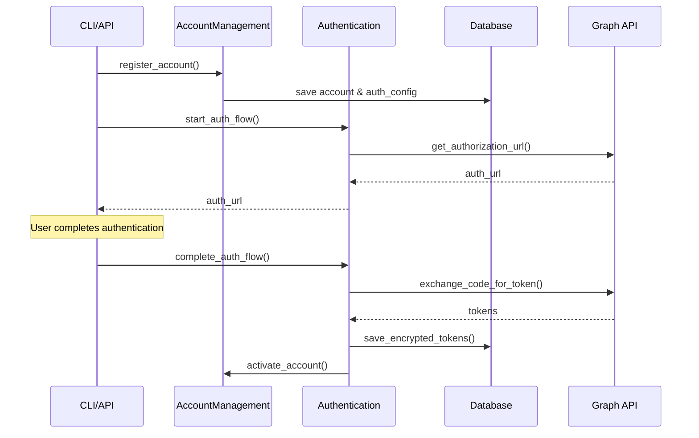
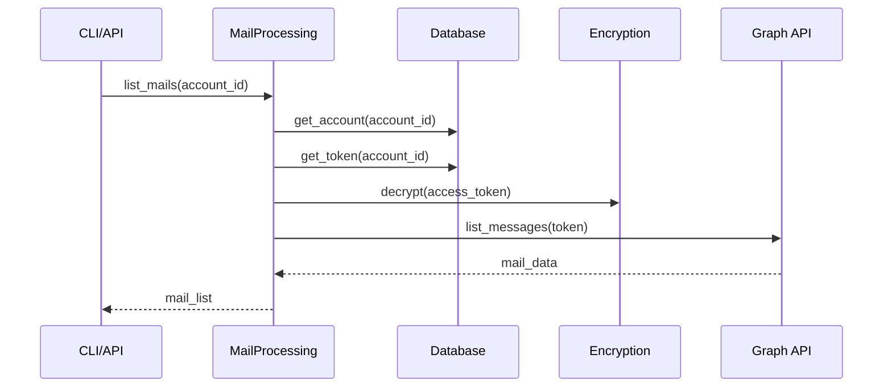
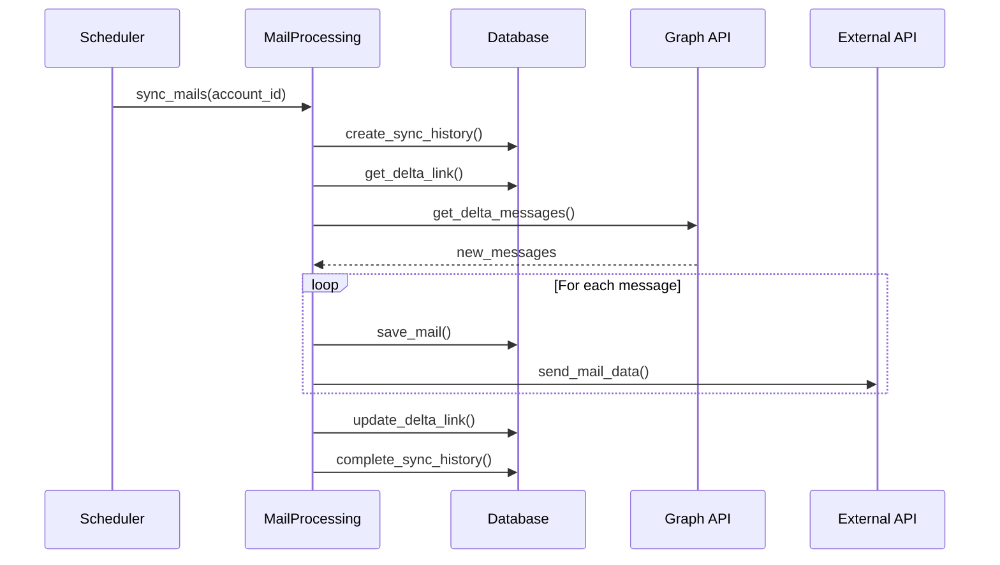

# 시스템 아키텍처 문서

## 개요

Microsoft 365 Graph API를 활용한 메일 처리 시스템의 아키텍처 문서입니다.
클린 아키텍처와 포트/어댑터 패턴을 적용하여 설계되었습니다.

## 아키텍처 원칙

### 1. 클린 아키텍처 (Clean Architecture)
- **핵심 로직의 독립성**: 비즈니스 규칙은 외부 의존성과 분리
- **의존성 역전**: 고수준 모듈이 저수준 모듈에 의존하지 않음
- **단일 책임 원칙**: 각 레이어는 명확한 책임을 가짐

### 2. 포트/어댑터 패턴 (Ports & Adapters)
- **포트**: 비즈니스 로직이 필요로 하는 인터페이스 정의
- **어댑터**: 포트를 구현하여 외부 시스템과 연결
- **교체 가능성**: 어댑터 교체를 통한 유연한 시스템 구성

## 레이어 구조

```
┌─────────────────────────────────────────────────────────┐
│                    Adapters Layer                        │
│  ┌─────────────┐  ┌──────────────┐  ┌────────────────┐ │
│  │   API       │  │     CLI      │  │   Database     │ │
│  │  (FastAPI)  │  │   (Typer)    │  │ (PostgreSQL)   │ │
│  └─────────────┘  └──────────────┘  └────────────────┘ │
└─────────────────────────────────────────────────────────┘
                            │
┌─────────────────────────────────────────────────────────┐
│                     Core Layer                          │
│  ┌─────────────────────────────────────────────────────┐ │
│  │                  Usecases                           │ │
│  │  ┌─────────────┐  ┌──────────────┐  ┌────────────┐ │ │
│  │  │   Account   │  │     Auth     │  │    Mail    │ │ │
│  │  │ Management  │  │              │  │ Processing │ │ │
│  │  └─────────────┘  └──────────────┘  └────────────┘ │ │
│  └─────────────────────────────────────────────────────┘ │
│  ┌─────────────────────────────────────────────────────┐ │
│  │                   Domain                            │ │
│  │  ┌─────────────┐  ┌──────────────┐  ┌────────────┐ │ │
│  │  │  Entities   │  │    Ports     │  │   Values   │ │ │
│  │  └─────────────┘  └──────────────┘  └────────────┘ │ │
│  └─────────────────────────────────────────────────────┘ │
└─────────────────────────────────────────────────────────┘
```

## 핵심 컴포넌트

### 1. Domain Layer

#### Entities (도메인 엔티티)
- **Account**: Microsoft 365 계정 정보
- **Token**: OAuth 토큰 정보
- **Mail**: 메일 메시지 정보
- **SyncHistory**: 동기화 이력
- **DeltaLink**: 증분 동기화를 위한 델타 링크
- **WebhookSubscription**: 웹훅 구독 정보

#### Ports (포트 인터페이스)
- **Repository Ports**: 데이터 저장소 인터페이스
  - AccountRepositoryPort
  - TokenRepositoryPort
  - MailRepositoryPort
  - SyncHistoryRepositoryPort
  - DeltaLinkRepositoryPort
  - WebhookSubscriptionRepositoryPort

- **Service Ports**: 외부 서비스 인터페이스
  - GraphApiClientPort
  - EncryptionServicePort
  - ExternalApiClientPort
  - CacheServicePort
  - LoggerPort
  - ConfigPort

### 2. Usecases Layer

#### AccountManagementUseCase
- 계정 등록, 조회, 수정, 삭제
- 계정 상태 관리 (활성화, 비활성화, 오류 표시)
- 인증 설정 관리

#### AuthenticationUseCase
- **Authorization Code Flow**: 웹 기반 인증
- **Device Code Flow**: 디바이스 기반 인증
- 토큰 갱신 및 폐기
- 사용자 프로필 조회

#### MailProcessingUseCase
- 메일 목록 조회 (데이터베이스 토큰 활용)
- 메일 발송
- 메일 동기화 (전체/델타)
- 외부 API 연동

## 데이터 흐름

### 1. 계정 등록 및 인증 흐름



### 2. 메일 조회 흐름



### 3. 메일 동기화 흐름



## 보안 설계

### 1. 토큰 보안
- **암호화 저장**: AES-256을 사용한 토큰 암호화
- **자동 갱신**: 만료 임박 토큰 자동 갱신
- **안전한 폐기**: 토큰 폐기 시 완전 삭제

### 2. 인증 보안
- **State 검증**: CSRF 공격 방지
- **HTTPS 필수**: 모든 통신 암호화
- **권한 범위 관리**: 최소 권한 원칙

### 3. 데이터 보안
- **PII 마스킹**: 개인정보 로깅 시 마스킹
- **접근 제어**: 계정별 데이터 격리
- **감사 로깅**: 모든 중요 작업 로깅

## 확장성 설계

### 1. 수평적 확장
- **무상태 설계**: 세션 정보 외부 저장
- **로드 밸런싱**: 다중 인스턴스 지원
- **데이터베이스 샤딩**: 계정별 데이터 분산

### 2. 비동기 처리
- **메시지 큐**: 백그라운드 작업 처리
- **배치 처리**: 대량 데이터 효율적 처리
- **재시도 메커니즘**: 실패 시 자동 재시도

### 3. 모니터링
- **메트릭 수집**: 성능 지표 모니터링
- **알림 시스템**: 장애 발생 시 즉시 알림
- **로그 집계**: 중앙화된 로그 관리

## 설정 관리

### 1. 환경별 설정
- **Development**: 개발 환경 설정
- **Production**: 운영 환경 설정
- **Testing**: 테스트 환경 설정

### 2. 설정 검증
- **필수값 검증**: 운영 환경 필수 설정 확인
- **타입 검증**: Pydantic을 통한 타입 안정성
- **보안 검증**: 시크릿 복잡도 검증

### 3. 동적 설정
- **환경변수**: 런타임 설정 변경
- **설정 파일**: 구조화된 설정 관리
- **우선순위**: 환경변수 > 설정파일 > 기본값

## 테스트 전략

### 1. 단위 테스트
- **도메인 로직**: 비즈니스 규칙 검증
- **유즈케이스**: 시나리오별 테스트
- **포트 구현**: 인터페이스 준수 확인

### 2. 통합 테스트
- **데이터베이스**: 실제 DB 연동 테스트
- **외부 API**: Mock을 통한 API 테스트
- **전체 플로우**: End-to-End 테스트

### 3. 성능 테스트
- **부하 테스트**: 동시 사용자 처리 능력
- **스트레스 테스트**: 한계 상황 대응
- **내구성 테스트**: 장시간 운영 안정성

## 배포 전략

### 1. 컨테이너화
- **Docker**: 애플리케이션 컨테이너화
- **Docker Compose**: 로컬 개발 환경
- **Kubernetes**: 운영 환경 오케스트레이션

### 2. CI/CD
- **자동 빌드**: 코드 변경 시 자동 빌드
- **자동 테스트**: 배포 전 테스트 실행
- **무중단 배포**: Blue-Green 배포

### 3. 모니터링
- **헬스체크**: 애플리케이션 상태 확인
- **로그 수집**: 중앙화된 로그 관리
- **메트릭 수집**: 성능 지표 모니터링
