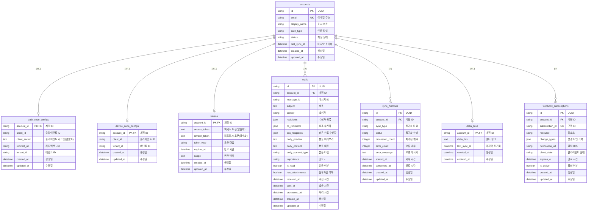

# 데이터베이스 테이블 관계도

Microsoft 365 Graph API Query 프로젝트의 데이터베이스 테이블 간 관계를 시각화합니다.

## ERD (Entity Relationship Diagram)



## 테이블 관계 설명

### 1. accounts (중심 테이블)
- **역할**: 모든 Microsoft 365 계정 정보를 저장하는 중심 테이블
- **관계**: 다른 모든 테이블과 연결되는 부모 테이블

### 2. auth_code_configs
- **관계**: accounts와 1:0..1 (선택적 일대일)
- **조건**: auth_type이 'authorization_code'인 계정만 해당 레코드 존재
- **외래키**: account_id → accounts.id

### 3. device_code_configs
- **관계**: accounts와 1:0..1 (선택적 일대일)
- **조건**: auth_type이 'device_code'인 계정만 해당 레코드 존재
- **외래키**: account_id → accounts.id

### 4. tokens
- **관계**: accounts와 1:0..1 (선택적 일대일)
- **설명**: 각 계정당 최대 하나의 활성 토큰 세트
- **외래키**: account_id → accounts.id

### 5. mails
- **관계**: accounts와 1:N (일대다)
- **설명**: 한 계정이 여러 메일을 가질 수 있음
- **외래키**: account_id → accounts.id

### 6. sync_histories
- **관계**: accounts와 1:N (일대다)
- **설명**: 한 계정이 여러 동기화 이력을 가질 수 있음
- **외래키**: account_id → accounts.id

### 7. delta_links
- **관계**: accounts와 1:0..1 (선택적 일대일)
- **설명**: 증분 동기화를 위한 델타 링크 (계정당 하나)
- **외래키**: account_id → accounts.id

### 8. webhook_subscriptions
- **관계**: accounts와 1:N (일대다)
- **설명**: 한 계정이 여러 웹훅 구독을 가질 수 있음
- **외래키**: account_id → accounts.id

## 데이터 무결성 규칙

### 외래키 제약조건
- 모든 자식 테이블의 account_id는 accounts.id를 참조
- 계정 삭제 시 관련된 모든 데이터 CASCADE 삭제

### 비즈니스 규칙
1. **인증 설정**: 계정의 auth_type에 따라 auth_code_configs 또는 device_code_configs 중 하나만 존재
2. **토큰 유일성**: 각 계정당 하나의 활성 토큰만 존재
3. **델타 링크**: 증분 동기화를 사용하는 계정만 delta_links 레코드 존재

### 인덱스 최적화
- 모든 외래키 컬럼에 인덱스 생성
- 자주 조회되는 컬럼 조합에 복합 인덱스 적용
- 시간 기반 조회를 위한 datetime 컬럼 인덱스

## 쿼리 예제

### 계정과 관련 정보 조회
```sql
-- 계정과 토큰 정보
SELECT a.email, a.display_name, t.expires_at, t.token_type
FROM accounts a
LEFT JOIN tokens t ON a.id = t.account_id
WHERE a.status = 'active';

-- 계정과 인증 설정
SELECT a.email, a.auth_type, 
       ac.client_id as auth_code_client,
       dc.client_id as device_code_client
FROM accounts a
LEFT JOIN auth_code_configs ac ON a.id = ac.account_id
LEFT JOIN device_code_configs dc ON a.id = dc.account_id;

-- 계정별 메일 통계
SELECT a.email, 
       COUNT(m.id) as total_mails,
       COUNT(CASE WHEN m.is_read = 0 THEN 1 END) as unread_mails
FROM accounts a
LEFT JOIN mails m ON a.id = m.account_id
GROUP BY a.id, a.email;
```

이 관계도를 통해 데이터베이스의 구조와 테이블 간의 연결 관계를 명확히 이해할 수 있습니다.
